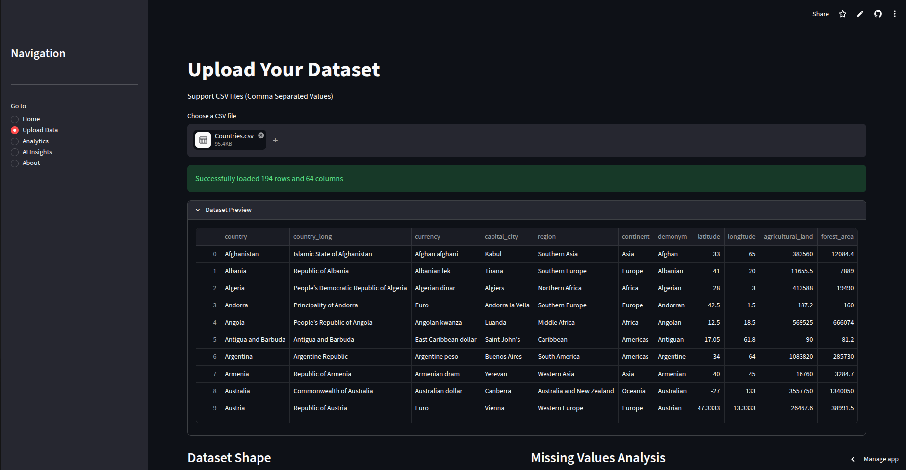
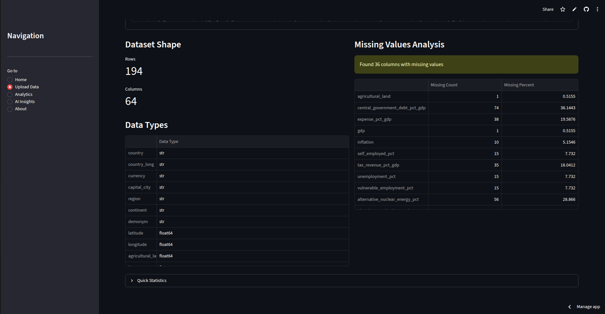
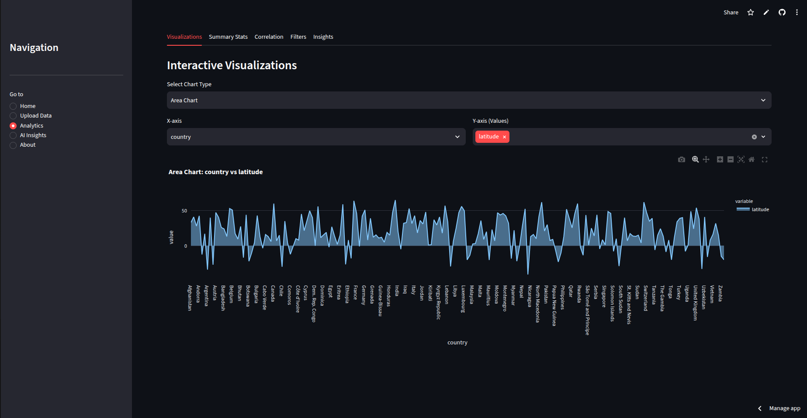
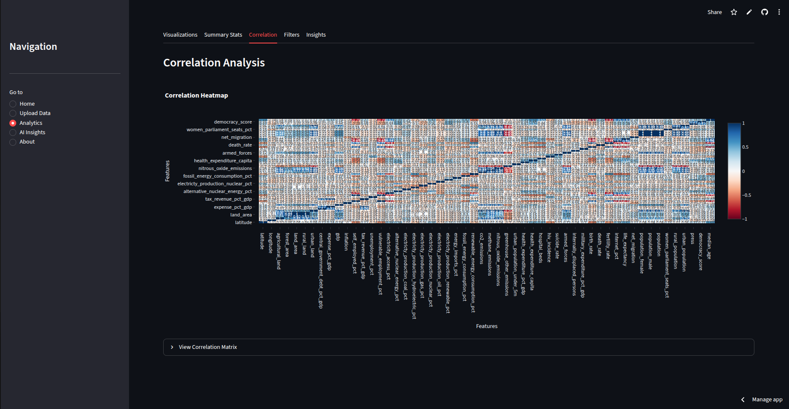
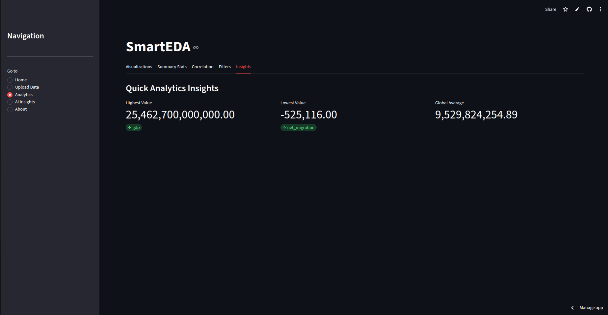

# 📊 SmartEDA
### Intelligent Exploratory Data Analysis Platform

<p align="center">


</p>

---

## 📌 Overview

**SmartEDA** is an intelligent Exploratory Data Analysis (EDA) web application developed using **Python** and **Streamlit**. It enables users to upload datasets, analyze data through interactive visualizations, inspect statistical properties, identify missing values and anomalies, and generate AI-inspired insights—all without writing code.

The primary goal of this project is to simplify the initial stage of any data science workflow by providing an intuitive, interactive, and visually appealing dashboard for dataset exploration.

---

# ✨ Features

### 📁 Dataset Upload
- Upload CSV datasets instantly
- Automatic dataset loading
- Preview uploaded data
- Display dataset dimensions

### 📈 Statistical Analysis
- Descriptive statistics
- Data type inspection
- Missing value detection
- Duplicate record detection
- Numerical and categorical summaries

### 📊 Interactive Visualizations
- Correlation Heatmap
- Histograms
- Scatter Plots
- Line Charts
- Bar Charts
- Pie Charts
- Box Plots
- Distribution Analysis

### 🤖 AI-Inspired Insights
- Automatic dataset observations
- Correlation analysis
- Outlier detection
- Statistical recommendations
- Data quality suggestions

### 🎨 Modern User Interface
- Streamlit dashboard
- Interactive controls
- Easy navigation
- Clean and responsive design

---

# 📸 Application Preview

## 🏠 Home

<p align="center">

</p>

---

## 📂 Upload Dataset

<p align="center">

</p>

<p align="center">

</p>

---

## 📊 Data Analysis Dashboard

<p align="center">

</p>

<p align="center">

</p>

<p align="center">

</p>

<p align="center">

</p>

<p align="center">

</p>

---

## 🤖 AI Insights

<p align="center">

</p>

---

## ℹ️ About

<p align="center">

</p>

---

# 🏗️ Project Structure

```text
SmartEDA/
│
├── app.py
│
├── utils/
│   ├── __init__.py
│   ├── analytics.py
│   ├── data_loader.py
│   └── insights.py
│
├── SmartEDA_Images/
│   ├── Home.png
│   ├── Upload_Data1.png
│   ├── Upload_Data2.png
│   ├── Analysis.png
│   ├── Analysis1.png
│   ├── Analysis2.png
│   ├── Analysis3.png
│   ├── Analysis4.png
│   ├── AI_insights.png
│   └── About.png
│
└── README.md
```

---

# ⚙️ Technologies Used

| Technology | Purpose |
|------------|---------|
| Python | Core Programming |
| Streamlit | Web Application Framework |
| Pandas | Data Processing |
| NumPy | Numerical Computing |
| Plotly | Interactive Visualizations |
| Matplotlib | Statistical Charts |
| Seaborn | Data Visualization |

---

# 🚀 Installation

Clone the repository

```bash
git clone https://github.com/your-username/SmartEDA.git
```

Move into the project

```bash
cd SmartEDA
```

Install dependencies

```bash
pip install -r requirements.txt
```

Run the application

```bash
streamlit run app.py
```

The application will launch automatically in your browser.

---

# 📖 How to Use

1. Launch the Streamlit application.
2. Upload a CSV dataset.
3. Explore the dataset preview.
4. View descriptive statistics.
5. Generate interactive visualizations.
6. Analyze correlations and distributions.
7. Review AI-generated insights and recommendations.

---

# 💡 Project Highlights

✔ Clean and modular Python architecture

✔ Interactive Streamlit dashboard

✔ Multiple visualization techniques

✔ Automatic statistical summaries

✔ AI-inspired analytical insights

✔ Easy-to-use interface for beginners and professionals

---

# 📚 What I Learned

During the development of SmartEDA, I gained practical experience in:

- Building interactive dashboards with Streamlit
- Data preprocessing and cleaning
- Exploratory Data Analysis (EDA)
- Data visualization principles
- Modular Python project architecture
- Statistical analysis using Pandas
- Interactive chart creation with Plotly
- Writing maintainable and reusable code

---

# 🔮 Future Enhancements

- Excel (.xlsx) support
- PDF report generation
- Machine Learning model integration
- Natural Language Query Interface
- Predictive Analytics
- User Authentication
- Cloud Deployment
- Dashboard Theme Customization

---

# 🎯 Intended Users

- Students learning Data Science
- Data Analysts
- Data Science Beginners
- Researchers
- Developers
- Anyone who wants quick insights from datasets

---

# 👨‍💻 Author

## Sai Satyam Biswal

Aspiring Software & AI Developer with a strong interest in:

- Python Development
- Data Analytics
- Machine Learning
- Artificial Intelligence
- Full Stack Development

This project was developed as part of my learning journey to strengthen my practical software development and data analytics skills.

---

# ⭐ Support

If you found this project helpful, please consider giving it a **Star ⭐** on GitHub.

It motivates me to continue building useful open-source projects.

---

## 📄 License

This project is intended for educational and portfolio purposes.

---

<p align="center">

### Thank you for visiting SmartEDA!

**Made with ❤️ using Python & Streamlit**

</p>
